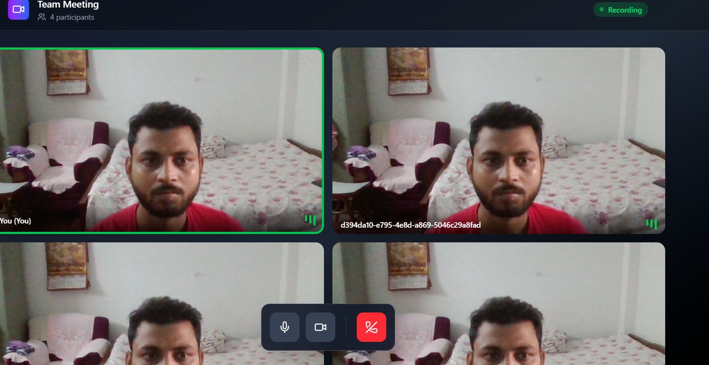

## Video Calling App

### Description

A lightweight, browser-based group video calling application. It lets people quickly create or join a room and talk face‑to‑face with multiple participants with minimal setup.

### What the application does

- **Group video calling**: Multi‑party rooms where everyone can see and hear each other.
- **Room management**: Create or join rooms via a simple room identifier.
- **Media controls**: Toggle camera and microphone (implementation details may vary per build).
- **Connection resilience**: Peers auto‑reconnect when network conditions fluctuate (within browser capabilities).

### Why these technologies

- **WebRTC**: Browser‑native, low‑latency audio/video transport with peer‑to‑peer media paths when possible.
- **PeerJS (signaling)**: Simplifies WebRTC peer connection setup and abstracts SDP/ICE exchange, reducing boilerplate and time‑to‑first‑frame.
- **Socket.IO (forwarding/unit of coordination)**: Acts as the single forwarding/coordination layer for room presence, events, and fallback messaging. This provides reliable event delivery, room membership tracking, and an easy way to broadcast join/leave and metadata updates.

In short: PeerJS handles the WebRTC signaling ergonomically, while Socket.IO provides dependable real‑time room coordination as a single forwarding unit.

### Architecture (high level)

1. A user joins a room and announces presence over **Socket.IO**.
2. The app establishes **PeerJS** connections to other participants for WebRTC media.
3. **Socket.IO server** forwards room events (join/leave, renegotiation triggers, status), keeping all clients in sync.
4. Media flows peer‑to‑peer when possible; TURN/STUN (if configured) assists NAT traversal.

### Main feature

- **Group video calling** using PeerJS as the signaling layer and a Socket.IO server as the single forwarding/coordination unit.

### Challenges faced

- **NAT traversal and connectivity**: Ensuring consistent STUN/TURN behavior across diverse networks.
- **Multi‑party scalability**: Mesh topologies can strain bandwidth/CPU as participants grow.
- **Stream lifecycle management**: Handling late joins, renegotiations, and device changes cleanly.
- **Reconnection logic**: Keeping rooms coherent when participants temporarily disconnect.

### Future enhancements

- **Recording and cloud storage** for meetings.
- **Text chat, reactions, and hand‑raise** alongside video.
- **Screen sharing** and selective stream subscription for performance.
- **Lobby/moderation controls** (admit/kick, mute others, roles).
- **Move toward an SFU** (Selective Forwarding Unit) for better scaling beyond small/medium rooms.
- **Metrics/observability**: Quality stats, connectivity health, and alerts.
